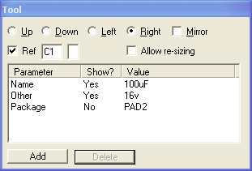
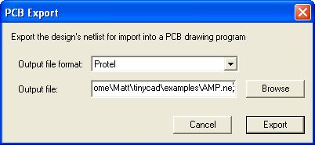

# Exporting to PCB programs

TinyCAD has the ability to create a netlist for import into a PCB layout program. However, for this to work to it's best potential you have to use TinyCAD in the correct way:

* Use wires and symbols correctly
* Add the “Package” attribute to symbols
* Export the netlist in a format compatible with your PCB layout program

## Use wires and symbols correctly

For TinyCAD to understand the circuit diagram, you must use the “wires” tool to wire up your circuits. If you were to use the polygon lines, then TinyCAD does not know this is a connection and will not export the connection to the netlist. To check that your circuit is wired correctly use the “Check Design Rules” option in the Special menu, before exporting the PCB netlist.

You must connect a wire to a symbol pin at the tip of the pin. This is normally done automatically for you. As you move a wire close to the symbol a red-circle is show indicating that the wire will be connected to an active point on the symbol. If you do not connect at this point, the wire will not be recognized as connected in the PCB netlist export.

## Add the “package” attribute to all symbols

When the netlist is exported this attribute is written out with the netlist so that the PCB program will know which footprint to use with the symbol. Remember the footprint can often be different for the same symbol in different places. For example a capacitor symbol in one part of your circuit may have a different footprint to a capacitor in a different part of the circuit.

You can edit the symbol libraries so that each symbol has a default “Package” attribute.

The example design “amp.dsn” has the “Package” attribute for each of the symbols that are used.

Export the netlist in a format compatible with your PCB layout program

From the Special menu select the “Create netlist for PCB program” option.

Use this dialogue to select the netlist output type and the filename you wish to use for the export. Currently TinyCAD has a limited select of file formats, however, you may well find that this format is recognized by your PCB program.

All of the output file formats are text based, so if you wish to see the result of the export, try loading the exported file into notepad or another text editor.
