# Your first drawing

At its simplest level, a TinyCAD drawing is a collection of symbols linked
using wires.

If TinyCAD is not running yet, start with the
[quick start](TinyCAD-Web-overview-and-quick-start.md).

## Example circuit

Here is a simple circuit to draw:

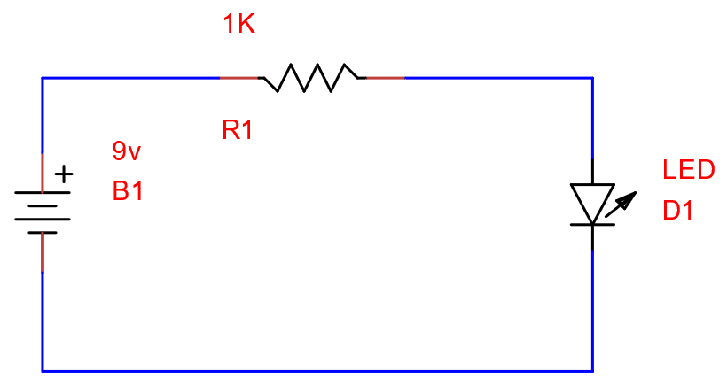

## Symbol libraries

1. Type `battery` in the search box.
2. Select **Multi Cell Battery**.
3. Drag the symbol from the symbol panel onto the drawing.

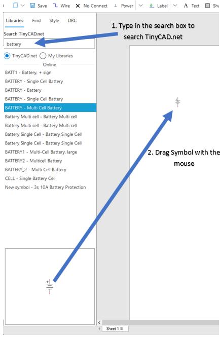

Now place a resistor and an LED.

Use the toolbar rotate/flip controls to orient symbols:

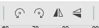

If you make a mistake, use Undo/Redo:

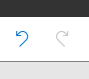

Your drawing should look similar to:

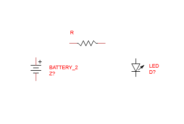

## Wiring up a circuit

1. Select the **Wire** tool.
2. Click a battery terminal to start a wire.
3. Move to the resistor terminal and click again to place the wire.

Wires snap to valid symbol connection points. A red circle indicates a snap
location.

Tip: press `W` on the keyboard to re-enter wire mode quickly.

After wiring, it should look similar to:

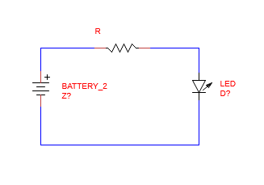

## Annotating the drawing

Symbols need component values and references. In TinyCAD these are typically
the symbol **Name** and **Ref** fields.

1. Click the battery.
2. Open the **Symbol** panel in the side panel menu.

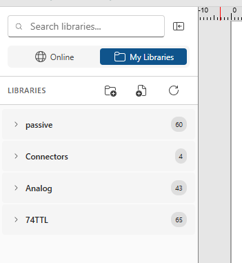

3. Change `BATTERY_2` to `9V`.
4. Change reference `Z?` to `B1`.

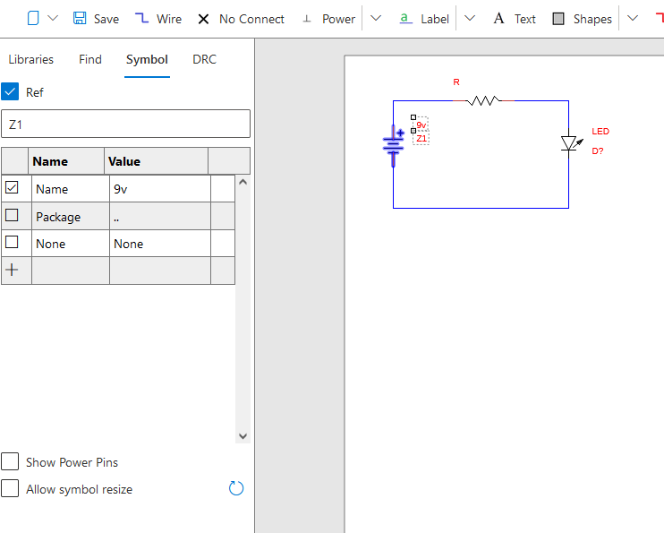

Repeat for the other parts:

- Resistor: Name `1K`, Ref `R1`
- LED: Name `Red Led`, Ref `D1`

If a name/reference is hidden, use the checkbox controls to show or hide text
on the drawing.

## Searching a drawing

Use **Find** from the side panel to search for text in the drawing:

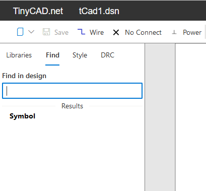

Enter text to get matching items. Selecting a result highlights that item in
the drawing. This is useful for finding references quickly.

## Exporting and printing

Use the toolbar menu **Print** option:

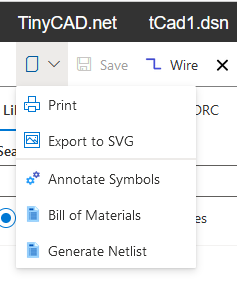

Most browsers open a PDF in a new tab. You can print directly or save the PDF.

You can also export SVG. SVG is useful for embedding in documents/web pages.
Notes:

- SVG export contains the current sheet only (single page format)
- Free SVG-to-DXF converters are available online

## Loading and saving

Your first drawing is complete. To rename it:

1. Click the drawing name at the top (for example `tCad1.dsn`).
2. Rename it to `First Drawing.dsn`.
3. Press Enter.

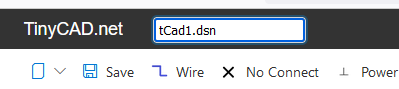

Save to Google Drive using the **Save** icon.

To load it again from Google Drive:

1. Open <https://drive.google.com/drive/>.
2. Find the drawing.
3. Right-click and choose **Open with -> TinyCAD**.

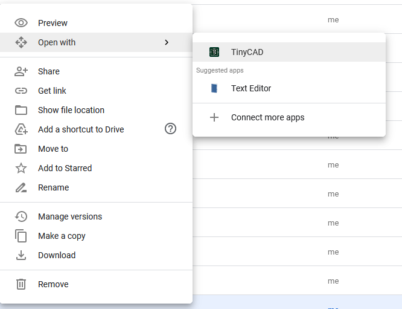

You can also rename and delete TinyCAD designs in Google Drive.

## Desktop integration

TinyCAD web file format is compatible with desktop TinyCAD. Download a drawing
from Google Drive and open it in the desktop app.

Likewise, upload existing drawings to Google Drive and use
**Open with -> TinyCAD**.

**Note:** Google Drive may sometimes treat extensions case-sensitively. If
`TinyCAD` is missing in **Open with**, ensure `.dsn` is lowercase.

## Design Rules Check (DRC)

DRC reports potential design mistakes, such as unconnected pins.

Aim for zero design errors to increase confidence in schematic correctness.

If a pin is intentionally unconnected, place a **No Connect** marker on that
pin to clear the error.

## Setup drawing

### Design Details box

The Design Details box can appear at the bottom-left of the drawing:

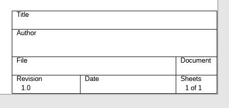

Edit it from the settings menu using **Design Details**:

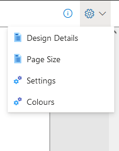

You can toggle the box on/off and configure design guides (letters/numbers
around the page edge):

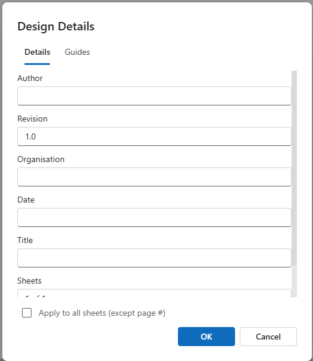

Design guides appear as follows:

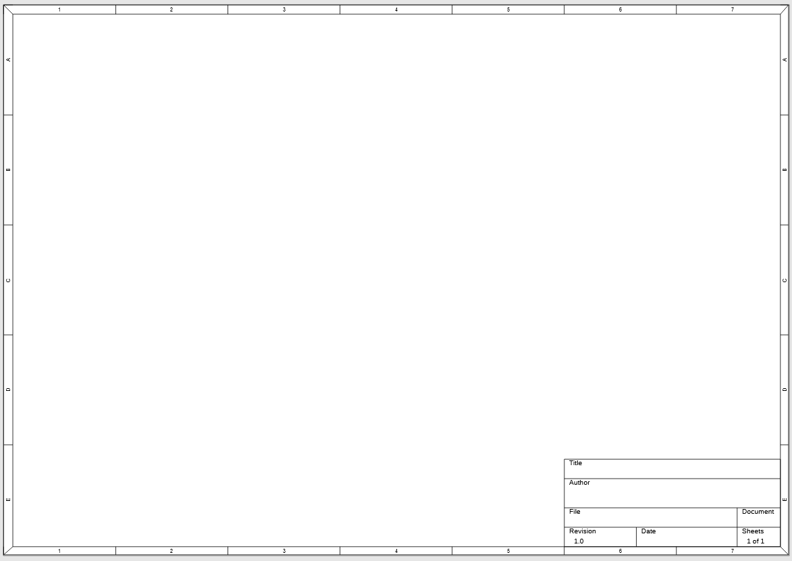

### Page size

Configure drawing size with the **Page Size** option in settings.

### Grid spacing

Configure grid spacing and related behavior in **Settings**.

Grid spacing matters: most components are drawn on **Small Grid**, and keeping
that grid makes pin alignment and wiring easier.

## Advanced drawing techniques

### Labels

Labels connect wires without drawing a physical wire between them. Labels with
the same name are considered connected.

Labels can also connect across sheets for multi-page designs.

Label shape does not affect netlisting or DRC connectivity.

### No-connects

Use no-connect markers to indicate that a pin is intentionally left
unconnected.

## Further reading

For custom symbols and libraries, continue with
[Custom symbol libraries](Custom-symbol-libraries.md).

- Back to [User guide](User-guide.md)
- Back to [v4 contents](CONTENTS.md)
